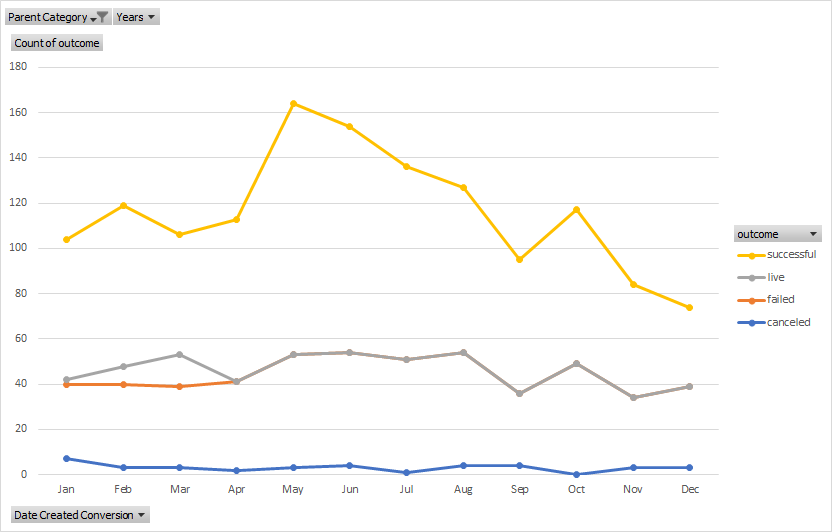
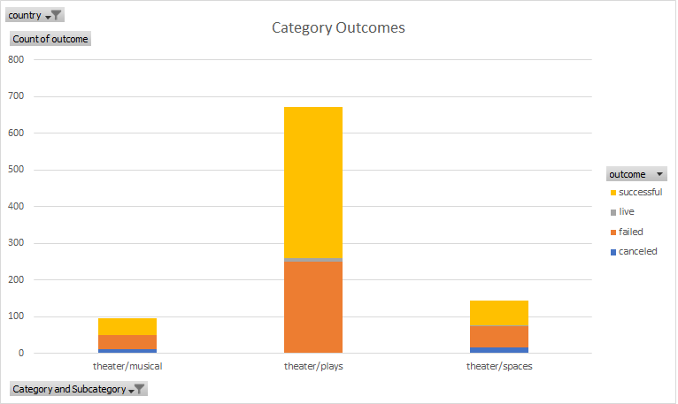
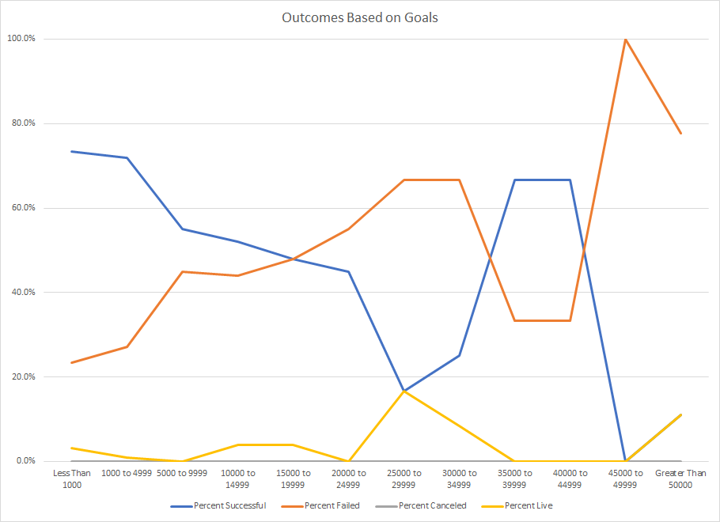
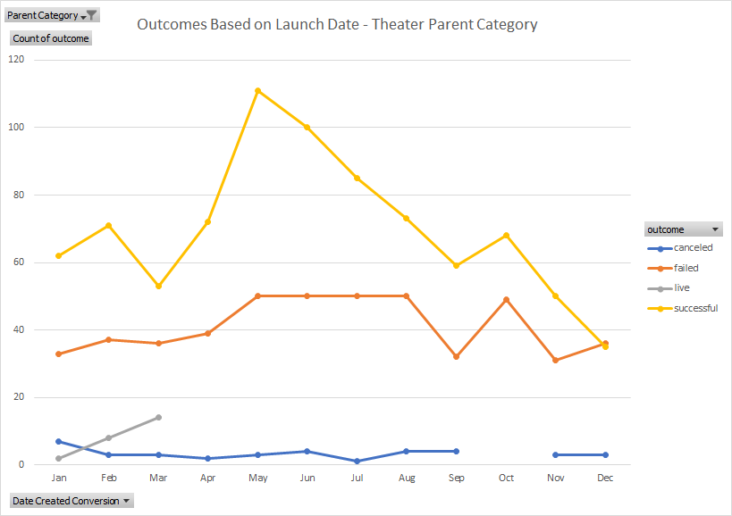
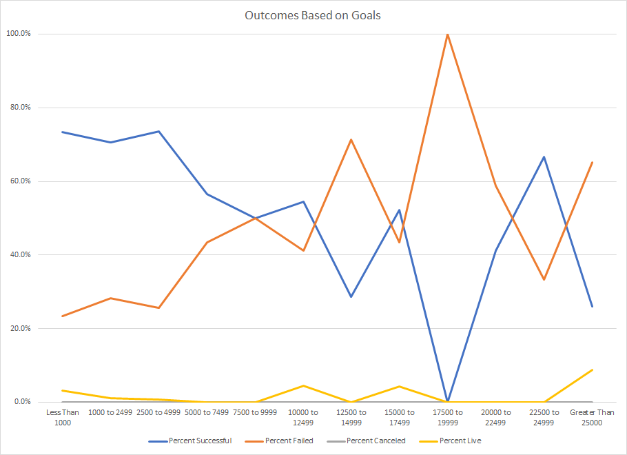
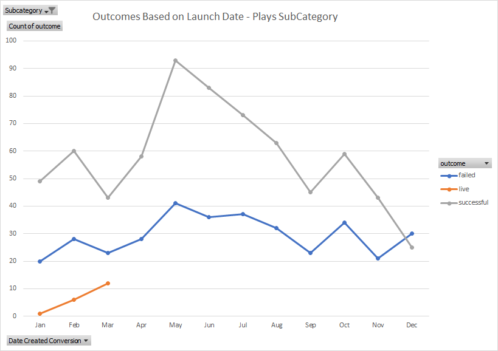

# An Analysis of Kickstarter Compaigns

## Kickstarter Data Analysis for Module 1 of UTDA Bootcamp

### Lesson Work

#### Conclusions from Analysis

1. The months with the highest success rates are May through July, November and Devember are the lowest. 

2. US Kickstarter Projects for Plays have a historical success rate of 61%. 
3. The mean goal of the successful projects is $5,049 vs $10,554 for the failed.

4. For projects with a goal from $8,000 to $10,000 the success rate is 53%.

#### Recommendations

1. Launch your kickstarter in May or June.

2. If you could launch at a lower goal you will have a better chance of success.

### Challenge Work

#### Conclusions

After looking at the kickstarter data I have the following conclusions and comments.  First, other than the 35,000 to 45,000 as funding goals increase success rates decrease. It is worth noting that there were only 9 projects with goals between 35,000 and 45,000, so this peak in the middle of the chart would likely disappear with a larger dataset. Second, the most dramatic change in success rate happens when the goal increases to 5000.  For projects less than 5000 the success rate is above 70%, for the 5000-9999 range the success rate drops to 55%.  The chart below shows this data.

Finally, the months with the highest chance of success are May, June and July.  The lowest success rates are in October, November and December, as seen in the graph below.

#### Additional Analysis and Recommendations

Based on small sample size of projects over 25,000, I would look at more data bins in the less than 25,000 range and use 1 group for great than 25,000.  The plot below shows the data with a different breakdown.

In order to look at the most appropriate data, using just the “play” data for the launch data trend analysis would be more appropriate.  The plot below confirms the same trend seen on the Theater data is present on the Play Data.

Additional analysis that may be beneficial would be a plot showing success rate versus the time between Launch Date and deadline.  There are 2 categories that would be worth more investigation, the “Staff Pick” and “Spotlight” category may have an impact on success.
